## 플러그인 소개
이 플러그인은 영어 위주로 되어있는 기존 텍스트 코드들을 한국어로 사용할 수 있게 해주는 플러그인입니다. 

**RPG Maker MV <font color='red'>v1.5.1</font> 이상 버전에서만 동작합니다.**

## 플러그인 다운로드
[다운로드][1]

[1]: https://minhaskamal.github.io/DownGit/#/home?url=https://github.com/biud436/MV/blob/master/RS_MessageSystem.js "마지막으로 작업한 파일입니다"

## 이름 윈도우 띄우기
대화창 위에 이름 윈도우를 띄우려면 아래와 같은 명령어를 사용할 수 있습니다. 텍스트와 함께 사용할 수 있는 명령어는 색상 변경 명령어입니다. (이름 윈도우의 폭은 자동으로 계산됩니다)

```md
\이름<텍스트>
```

이름 텍스트 끝에 콜론(:)을 붙이면, 이름 윈도우 표시 위치를 변경할 수 있습니다.

```css
\이름<텍스트:left>
\이름<텍스트:right>
\이름<텍스트:center>
\이름<텍스트:opacity0>
\이름<텍스트:defaultOpacity>
```
 
말풍선에 이름 윈도우를 설정하려면, 말풍선을 먼저 적고, 다음에 이름 텍스트 코드를 사용해야 합니다.

예:)
```css
\말풍선[0]\이름<러닝은빛>\색[빨강]안녕하세요?
```
 
예:)
```css
\이름<\색[red]이벤트명>
\이름<\색[주황]러닝은빛:right>
```

## 말풍선 설정
메시지 창이 말풍선처럼 해당 이벤트의 위쪽으로 옮겨집니다. (말풍선의 폭과 높이는 텍스트의 길이에 맞게 자동으로 계산됩니다)

```css
\말풍선[이벤트의 ID]
```
 
배틀러 스프라이트 위에 말풍선을 띄우려면 다음 텍스트 코드를 사용하세요.
전투의 경우, 번호는 1부터 시작합니다.
 
```css
 \아군[번호]
 \아군[1]은 \말풍선[1]과 같습니다.
 \아군[2]는 \말풍선[2]와 같습니다.
 
 \적그룹[번호]
 \적그룹[1]은 \말풍선[-1]과 같습니다.
 \적그룹[2]는 \말풍선[-2]와 같습니다.
```
 
해당 배틀러가 전투 불능 상태일 경우 또는 존재하지 않을 경우 일반 메시지 창으로 나오게 됩니다.

전투 장면에서 \말풍선[배틀러의 ID]의 배틀러 ID 값에 마이너스(-) 값을 전달하면, **적 배틀러에 말풍선을 띄웁니다.**
플러스(+) 값을 전달할 경우, **아군에게 띄웁니다.**

```javascript
\말풍선[1] // 파티원 1
\말풍선[2] // 파티원 2
\말풍선[3] // 파티원 3
\말풍선[4] // 파티원 4
\말풍선[5] // 파티원 5가 없으면 파티원 4 위에 설정됩니다.
\말풍선[-1] // 적 배틀러 1
\말풍선[-2] // 적 배틀러 2
```

전투 장면에선 음수 또는 양수를 전달해야 하므로 **ID 값은 0이 될 수 없습니다. 0으로 설정하면 일반 메시지로 나오게 됩니다.**

복잡하게 느껴진다면 ```\말풍선[인덱스]``` 대신 ```\아군[인덱스]```, ```\적그룹[인덱스]```을 사용하세요.

## 이 이벤트 위에 말풍선 설정
일반 맵에서만 동작합니다. 전투 장면에서는 동작하지 않습니다. 
```css
\말풍선[0]
```

## 플레이어 위에 말풍선 자동 설정
일반 맵에서만 동작합니다. 전투 장면에서는 다음 명령을 사용하면 적 배틀러 위에 말풍선이 설정됩니다.
```css
\말풍선[-1]
```

## 텍스트 출력 속도 변경
모든 텍스트의 출력 속도를 조절할 수 있는 명령어입니다. 

숫자의 단위는 프레임이며 값이 커질 수록 출력 속도가 느려집니다. 

이 메시지는 대화창에서 한 번만 수행되며 다음 대화가 시작되면 플러그인 매개변수에 설정된 값으로 초기화됩니다.

```css
\속도[숫자값]
```

## 텍스트 굵기 및 텍스트 기울임 설정
```<B></B>``` 또는 ```<I></I>``` 태그를 사용하여 굵기 및 기울임을 설정할 수 있습니다.
 
말풍선, 이름 윈도우를 혼용하면 다음과 같습니다.
 
텍스트는 아래와 같고,
 
```\말풍선[0]\이름<알리미><I>제단</I> 위에 <B>제물</B>을 바치십시오.```
 
실제로 이렇게 입력해야 합니다.

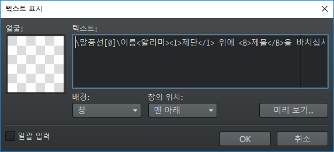

이렇게 하면 다음과 같이 나오게 됩니다.

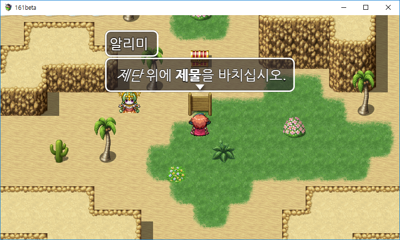

예)
```css
<B>유령의 저택</B>에 함부로 들어가선 안돼.
<I>정신력</I> 문제는 아니야.
```

## 폰트 설정
대화창의 폰트는 일반적으로 컴퓨터에 설치된 시스템 폰트를 기본적으로 사용합니다. 일반적으로는 나눔고딕, Dotum, AppleGothic, sans-serif을 로드합니다. 

게임을 플레이하는 유저분들의 컴퓨터에 나눔고딕이 설치되어있지 않은 경우, 폰트가 두 번째 폰트로 설정됩니다. 이를 막으려면 다음 스크린샷처럼 커스텀 폰트를 로드해야 합니다.

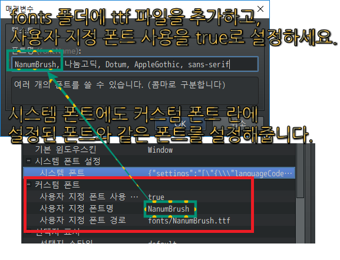

폰트는 기본적으로 ```./fonts``` 폴더에 있는 기본 폰트만 로드되지만 원한다면 추가 폰트 파일을 로드할 수 있습니다. 

설정된 커스텀 폰트는 메시지 창에만 적용되므로, 전체적으로 적용시키고 싶다면 스크린샷과 같이 시스템 폰트로도 설정해야 합니다.


## 텍스트 색상 변경
다양한 색상 코드를 사용할 수 있습니다. 미리 입력된 색을 사용할 수도 있고 웹 색상을 설정할 수도 있습니다. 이것은 최상위 클래스에 정의되므로 어느 창에서나 사용할 수 있습니다. 다만 텍스트 코드를 처리하는 창에서만 사용해야 합니다:

```css
\색[색상명]
\테두리색[색상명]
```

사용 가능한 색상은 다음과 같습니다.

```css
\색[기본색] - 이 색은 기본 윈도우 스킨 하단 색상 테이블에 위치한 0번 색과 같습니다.
\색[청록]
\색[검은색]
\색[파란색]
\색[짙은회색]
\색[자홍색]
\색[회색]
\색[녹색]
\색[밝은녹색]
\색[밝은회색]
\색[밤색]
\색[감청색]
\색[황록색]
\색[주황색]
\색[보라색]
\색[빨간색]
\색[은색]
\색[민트색]
\색[흰색]
\색[노란색]
\색[기본]
\색[청록색]
\색[검정]
\색[파랑]
\색[c_dkgray]
\색[자홍]
\색[c_gray]
\색[c_green]
\색[라임]
\색[c_ltgray]
\색[마룬]
\색[네이비]
\색[올리브]
\색[주황]
\색[보라]
\색[빨강]
\색[은]
\색[c_teal]
\색[흰]
\색[노랑]
\색[오렌지]
\색[c_orange]
\색[c_aqua]
\색[c_black]
\색[c_blue]
\색[c_fuchsia]
\색[c_lime]
\색[c_maroon]
\색[c_navy]
\색[c_olive]
\색[c_purple]
\색[red]
\색[c_red]
\색[c_silver]
\색[white]
\색[c_white]
\색[c_yellow]
\색[c_normal]
```

미리 정의한 색상 말고도 다른 색상을 사용하려면 이렇게 하면 됩니다.

```CSS
\색[#ffffff] 과 \색[white]는 흰색입니다.
\색[rgb(255, 0, 0)]과 \색[red] 그리고 \색[#ff0000]은 빨강색입니다.
\색[aqua], \색[lime] 등 브라우저에 기본 정의된 색상 테이블에서도 가져올 수 있습니다.
```

웹 색상의 경우, ```#RRGGBBAA``` 포맷을 사용하며, 각각 빨강, 녹색, 파랑, 알파(Alpha)를 뜻합니다. 16진수 값이며 FF는 완전 불투명을 의미하고 88은 반투명이며 00은 완전히 투명한 색상입니다. 알파값을 생략하면 기본 FF로 설정됩니다. 웹 색상 값은 포토샵이나 색상 표를 검색하면 쉽게 알아낼 수 있습니다.

## 텍스트에 그레디언트 적용

```md
\그레디언트<텍스트>
```

그레디언트 색상값은 3가지 색상값으로 조합이 가능하며 플러그인 매개변수나 플러그인 커맨드를 통해 색상값을 바꿀 수 있습니다.
 
플러그인 커맨드 사용법은 아래와 같습니다.

```text
메시지 그레디언트 주황 흰색 빨강
```

## 텍스트 들여쓰기
텍스트 에디터에서 흔히 볼 수 있는 오른쪽 들여쓰기 기능으로 숫자값은 픽셀 단위입니다. 들여쓰기 기능은 특정 텍스트를 특정 위치로 옮기고자 할 때 사용하면 좋은 기능입니다.

```css
\들여쓰기[숫자값]
```

## 선택지 스타일의 변경
선택지 스타일을 RPG Maker XP 스타일로 설정할 수가 있습니다. 

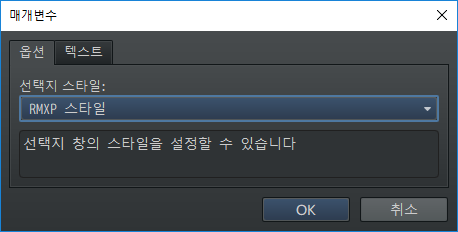

XP 스타일로 설정할 경우, 다음과 같이 선택지 창이 안으로 나오게 됩니다.

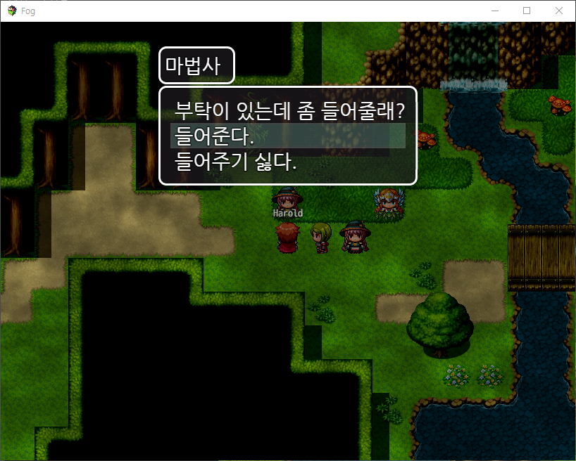

선택지 확장이나 라인 수가 4보다 클 경우 호환되지 않으니 주의하세요.

## 텍스트 정렬

정렬자는 텍스트의 정렬을 할 수 있는 명령어로 가운데 정렬과 오른쪽 정렬을 지원합니다. 
 
가운데 정렬은 ```\정렬자[1]``` 
오른쪽 정렬은 ```\정렬자[2]``` 입니다
 
왼쪽 정렬은 ```\정렬자[0]``` 입니다.
 
태그처럼 사용할 수도 있습니다.

```html
<CENTER>가운데</CENTER>
<right>오른쪽</right>
<left> 태그는 메시지 시작 전에 정렬자 텍스트 코드로 정확히 자동 변환됩니다.</left> 
```

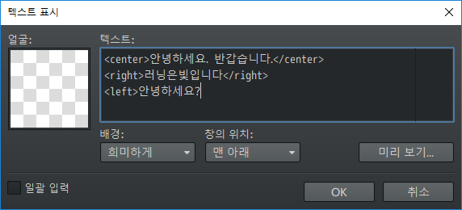
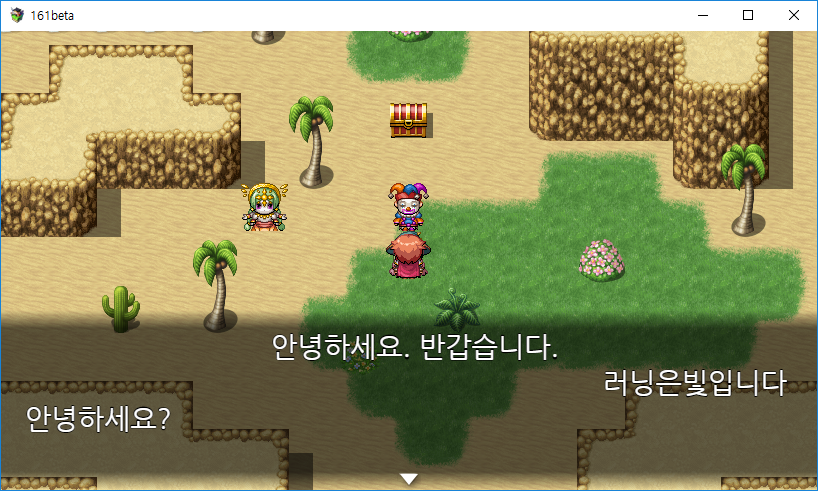
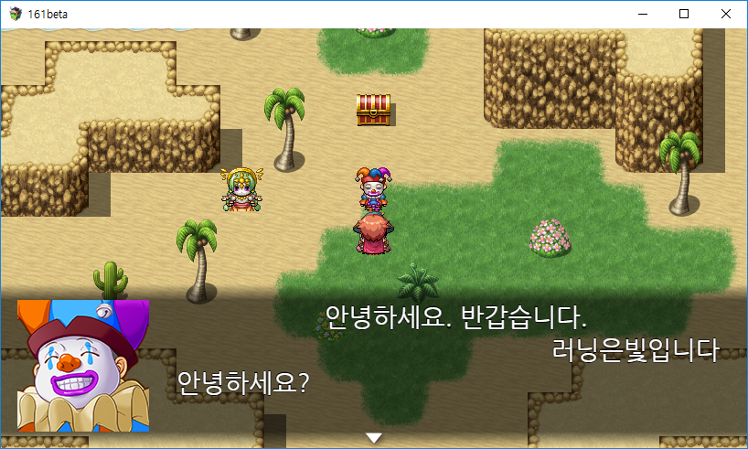

## 큰 페이스칩의 설정
큰 페이스칩을 설정하려면 소재를 img/faces 폴더에 넣어주시기 바랍니다. 큰 페이스칩은 ```Big_``` 이라는 머릿말이 붙어있어야 합니다.

큰 페이스칩은 페이스칩의 인덱스값을 읽어 정렬 위치를 정하게 됩니다.
 
이때, 페이스칩의 인덱스가 ```0``` 일 경우(흰 선택 칸이 가장 왼쪽 위에 위치하면) 왼쪽에 표시되고, 다른 번호면 오른쪽에 표시됩니다.
 
즉, 위 스크린샷과 같이 페이스칩의 인덱스를 ```1``` 로 설정할 경우 오른쪽에 표시됩니다.

얼굴 이미지는 ```\얼굴<이미지명, 이미지 인덱스>``` 텍스트 코드를 사용해서 중간에 변경할 수도 있습니다. ```RPG Maker MV 1.5.0``` 이상 버전을 사용하고 계시다면 텍스트를 읽어들이기 전에 얼굴 이미지를 바꾸는 텍스트 코드가 있는 지를 확인하여 사전에 이미지를 자동으로 로드합니다. 하지만 RMMV 최신 버전이 아니라면, 그 기능이 적용되지 않기 때문에 별도로 프리로드를 해야 합니다.

## 라인 갯수 변경
대화창의 기본 라인 수를 변경하고 싶을 경우 아래와 같이 메시지 라인이라는 플러그인 커맨드를 사용하여 라인 수를 변경할 수 있습니다.

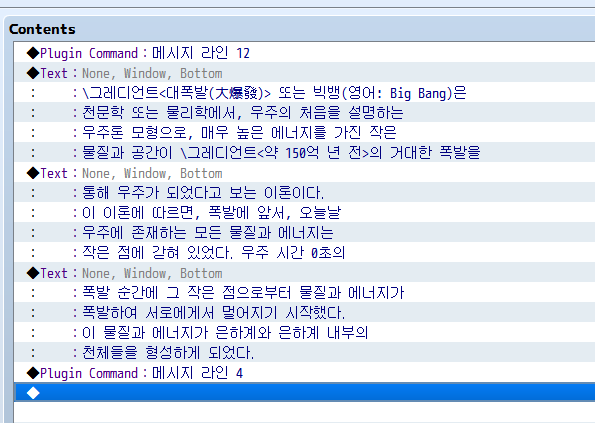

## 통화 서식 지정
숫자에 통화 서식을 지정하여 세 자릿수 마다 콤마를 자동으로 찍어 출력합니다.

```
\숫자[값]
```

## 텍스트 코드 변경 기능
텍스트 코드를 원하는 텍스트 코드로 변경할 수 있습니다. 끝에 느낌표가 붙어있는 경우, 느낌표는 변경하지 말고 그대로 둬야 합니다. 

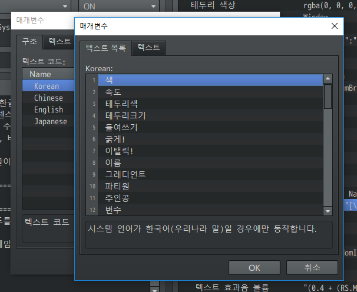

## 노트 태그 기능
문장의 표시가 시작되기 전에 메시지 설정을 노트 태그로 바꾸는 기능입니다.
문장의 표시 바로 위에 있는 노트 커맨드 2개만 읽어옵니다.
 
RPG Maker MV는 이전 시리즈와 달리 동기 방식이 아니라 비동기 방식으로 이미지를 로드합니다.
따라서 윈도우 스킨 변경 명령의 경우, 이미지를 사전에 미리 로드해두어야 합니다.

플러그인 매개변수에 있는 프리로드 기능을 사용하세요.
면밀히 테스트 해본 결과, 사전에 로드하는 것이 제일 잘 동작합니다.
미리 로드하지 않으면, 윈도우 스킨의 픽셀 값을 읽지 못해 폰트가 검정색으로 나오는 등의 문제가 생깁니다.
그런 경우를 대비하여 이전에 미리 설정해놓은 윈도우스킨의 기본색으로 채우게 해놨지만, 
윈도우 스킨에서 텍스트 색상을 가져오는 텍스트 색상 변경 명령의 경우, 제대로 동작하지 않게 됩니다.

```html
<윈도우 스킨:Window>
<이름 윈도우 스킨:Window>
<라인 높이:36>
<폰트 크기:28>
<텍스트 시작 X:256>
<큰 페이스칩 OX:0>
<큰 페이스칩 OY:0>
<대화창 뒤에 얼굴 표시:true>
<대화창 투명도:255>
<텍스트 효과음 재생 여부:true>
<기본 텍스트 출력 속도:0>
```

노트 태그의 경우, 전부 한국어입니다. 한국어로 설정을 해두면 가독성이 좋아집니다. 해외 유저가 한국어로 된 게임을 영어로 번역을 하는 경우는 흔치 않고 대부분 개발자가 직접 영어로 번역하므로 문제가 없을 것으로 보여집니다.

영어, 일본어, 중국어 텍스트 코드까지 지원하는 플러그인이지만, 실제로 이 언어들을 사용하는 국가에서 이 플러그인을 쓰고 있진 않습니다. 그래서 그냥 한국어로만 작성하였습니다. (영어, 일본어, 중국어 텍스트 코드를 사용하고 있다는 분이 한 분이라도 있다면 필자에게 연락을 하십시오.)

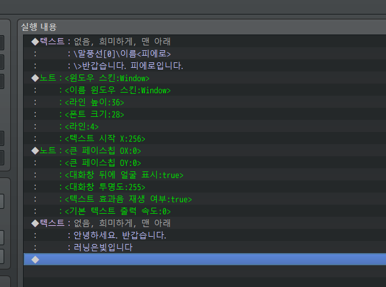

0을 입력하면 기본 값이 나오는 게 아니라 0이 입력되니 주의하시기 바랍니다. 이는 값을 잘못 입력했을 때 기본 값이 나오게 하는 기능이었지만 정작 0을 입력할 수가 없어서 이 기능을 제외했으며 모든 값을 입력할 수 있게 해놨습니다. 다만 잘못 입력하면 오류가 생길 수도 있다는 점을 잊지 마십시오.

## 전체 명령어 목록 (Text Codes)
전체 명령어 목록입니다. 위에서 설명하지 않은 기능들도 있습니다. 

### Korean Text Codes (한국어)

언어 코드를 ```ko```로 설정을 해두셔야 한국어 텍스트 코드를 인식합니다. 

나중에 게임을 영어나 일본어로 번역할 때에도 이 부분은 텍스트 코드 그 자체이니 그대로 둬야 합니다.  

물론 영어로 바꿔서 사용을 하는 방법도 있습니다. 이 경우, English 텍스트 코드를 참고해주세요.

```css
 \색[색상명]
 \속도[값]
 \테두리색[색상명]
 \테두리크기[값]
 \들여쓰기[값]
 \굵게!
 \이탤릭!
 \이름<이벤트명>
 \그레디언트<텍스트>
 \파티원[번호]
 \주인공[번호]
 \변수[번호]
 \아이콘[번호]
 \확대!
 \축소!
 \골드
 \말풍선[이벤트의 ID]
 \말풍선[0]
 \말풍선[-1]
 \정렬자[1]
 \정렬자[2]
 \숫자[숫자]
 \크기[숫자]
 \탭!
 \캐리지리턴!
 \효과음<효과음명>
 \그림표시<그림번호, 그림이름, 원점번호, X좌표, Y좌표>
 \그림제거[그림번호]
 \아이템[번호]
 \무기구[번호]
 \방어구[번호]
 \직업[번호]
 \적군[번호]
 \상태[번호]
 \스킬[번호]
 \얼굴<얼굴_이미지_이름,얼굴_이미지_인덱스>
 \아군[번호] * 전투에서만 사용 가능
 \적그룹[번호] * 전투에서만 사용 가능
 <B></B>
 <I></I>
 <LEFT></LEFT>
 <CENTER></CENTER>
 <RIGHT></RIGHT>
 ```

### Japanese Text Codes (日本語 : 制御文字)

언어 코드를 ```ja```로 설정을 해야 일본어 텍스트 코드가 인식됩니다.

사용 가능한 한자 범위는 한중일 통합 한자 영역입니다. 

Tkool 홈페이지에 있는 실제로 사용되고 있는 어휘를 참고하였습니다. 

일본어의 경우, PC에서 글자를 입력하기가 매우 불편하기 때문에 실제로 이렇게 쓰시려는 분들은 없을 거라고 봅니다.

한국어에서 일본어로 번역하면 길어지는 경우가 꽤 있었습니다. 특히 외래어의 경우, 카타카나로 표기해야 하는데 그게 꽤 길어집니다. 

텍스트 코드는 매개변수에서 직접 수정이 가능하니 일본어가 가능하신 분들은 수정하여 사용하시기 바랍니다.

```css
 \色[html_color_name]
 \テキストスピード[value]
 \輪郭の色[color_name]
 \輪郭のサイズ[value]
 \インデント[value]
 \太字!
 \斜体!
 \名前<event_name>
 \グラデーション<text>
 \パーティーメンバー[nth]
 \アクタ[nth]
 \変数[nth]
 \アイコン[nth]
 \INCREASE!
 \DECREASE!
 \通貨単位表示
 \フキダシ[event_id]
 \フキダシ[0]
 \フキダシ[-1]
 \整列[1]
 \整列[2]
 \数字[number]
 \テキストのサイズ[number]
 \TAB!
 \CR!
 \効果音<se_name>
 \ピクチャの表示<nth, picture_name, origin_number, x, y>
 \ピクチャの消去[nth]
 \アイテム[nth]
 \武器[nth]
 \防具[nth]
 \職業[nth]
 \敵キャラ[nth]
 \ステート[nth]
 \スキル[nth]
 \顔<face_name,face_index>
 \FRIENDLY_TROOPS[nth]
 \ENEMY_TROOPS[nth]
 <B></B>
 <I></I>
 <LEFT></LEFT>
 <CENTER></CENTER>
 <RIGHT></RIGHT>
 ```

### Simplified Chinese Text Codes (中文)

언어 코드를 ```zh```로 설정을 해야 중국어 텍스트 코드가 인식됩니다. 

작업은 바이두 영어 사전을 참고하여 번역하였습니다. 

대부분 바이두를 참고했기 때문에 간체자라고 해놨지만 번체일 수도 있습니다. 

입력하기가 불편하기 때문에 실제로 이렇게 쓰시는 분들은 없을 거라고 봅니다.

 ```css
 \色[color_name]
 \速度[value]
 \轮廓颜色[color_name]
 \轮廓宽度[value]
 \缩进[value]
 \加粗!
 \倾斜!
 \名字<event_name>
 \渐变颜色<text>
 \队伍成员[nth]
 \角色[nth]
 \变量[nth]
 \图标[nth]
 \增大!
 \减少!
 \金币
 \对话框[event_id]
 \对话框[0]
 \对话框[-1]
 \对齐[1]
 \对齐[2]
 \数[number]
 \大小[number]
 \TAB!
 \CR!
 \音效播放<se_name>
 \显示图像<pic_nth, picture_name, origin, x, y>
 \隐藏图像[nth]
 \道具[nth]
 \武器[nth]
 \装甲[nth]
 \职业[nth]
 \敌人[nth]
 \状态[nth]
 \技能[nth]
 \脸<face_name,face_index>
 \我军[nth] 
 \敌人组[nth] 
 <B></B>
 <I></I>
 <LEFT></LEFT>
 <CENTER></CENTER>
 <RIGHT></RIGHT>
```

### English Text Codes

한글 텍스트 코드가 싫다면, 영어로된 텍스트 코드를 사용하셔도 됩니다. 다만 약간 수정이 필요한데요.

언어 코드를 ```en```으로 설정을 해야 합니다. 

텍스트 코드가 길어서 외우기 힘들다면, 직접 이니셜을 만들어서 사용하세요. 짧은 이니셜의 경우, 다른 플러그인과 충돌할 가능성이 크기 때문에 생각보다 네이밍하기가 쉽지 않았습니다. 

사실 이 네이밍 작업은 난이도 꽤 높습니다. 기본 텍스트 코드와 같아서도 안되며 다른 메시지 플러그인의 텍스트 코드와 겹쳐서도 안됩니다.

한글이 싫은 분들이 있다면, 있을까 싶지만 그런 분들이 있다면 긴 텍스트 코드를 어떻게 짧게 바꿔서 쓰셔도 무방합니다. 

이건 여러분들의 선택에 맞깁니다.


 ```html
 \COLOR[html_color_name]
 \TEXT_SPEED[value]
 \OUTLINE_COLOR[color_name]
 \OUTLINE_WIDTH[value]
 \INDENT[value]
 \BOLD!
 \ITALIC!
 \NAME<event_name>
 \GRADIENT<text>
 \PARTY_MEMBER[nth]
 \PLAYER[nth]
 \VAR[nth]
 \ICON[nth]
 \INCREASE!
 \DECREASE!
 \GOLD
 \BALLOON[event_id]
 \BALLOON[0]
 \BALLOON[-1]
 \ALIGN[1]
 \ALIGN[2]
 \NUM[number]
 \TEXT_SIZE[number]
 \TAB!
 \CR!
 \PLAY_SE<se_name>
 \SHOW_PICTURE<nth, picture_name, origin_number, x, y>
 \HIDE_PICTURE[nth]
 \ITEM[nth]
 \WEAPON[nth]
 \ARMOR[nth]
 \CLASSES[nth]
 \ENEMY[nth]
 \STATE[nth]
 \SKILL[nth]
 \FACE<face_name,face_index>
 \FRIENDLY_TROOPS[nth]
 \ENEMY_TROOPS[nth]
 <B></B>
 <I></I>
 <LEFT></LEFT>
 <CENTER></CENTER>
 <RIGHT></RIGHT>
 ```

한국어 텍스트 코드 이외에 중국어, 일본어를 쓰시는 분은 없을 듯 합니다. 한국어 입력은 조합형이지만 중국어와 일본어의 경우, 영어로 입력한 후 맞는 글자를 찾는 것이므로 입력이 불편하므로 쓰기에 적합하지 않다는 걸 알고 있습니다. 또한 지금까지 번역이 잘못되었다는 말이 없는 걸 보면 아무도 쓰지 않는 듯 합니다. 또한 영어로 번역을 해두지 않았기 때문에 사용자가 아예 없을 것입니다.

## 플러그인 커맨드

텍스트의 속도는 0에서 가장 빠르고, 프레임 단위로 지정할 수 있습니다.
 
```
 메시지 텍스트속도 number

 메시지 폰트크기 number
 메시지 폰트최소크기 number
 메시지 폰트최대크기 number
```

그레디언트 텍스트로 색상을 변경할 수 있습니다.
 
```
 메시지 그레디언트 color1 color2 color3
```
라인 수를 바꿀 수 있는 플러그인 명령입니다.

```
 메시지 라인 number
```

```
 메시지 시작위치 number
 메시지 이름윈도우 x number
 메시지 이름윈도우 y number
 메시지 이름윈도우 padding number
 메시지 이름윈도우 윈도우스킨 skin_name
 메시지 큰페이스칩X number
 메시지 큰페이스칩Y number
```
 

number가 -1이면 메시지 창이 페이스칩을 가리고, 다른 값이면 가리지 않습니다:

```
 메시지 큰페이스칩Z number
```
 
```
 메시지 탭크기 number
 메시지 배경투명도 number
 메시지 컨텐츠투명도 number
 메시지 윈도우스킨 skin_name
```
 
윈도우 스킨 명령어 사용 시 이미지 파일을 미리 로드 해두어야 합니다. (플러그인 매개변수에 있는 프리 로드 기능을 사용하세요)